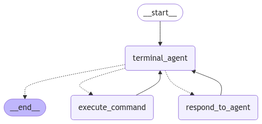

# Terminal agent

This repository shows how you can set up a simple "terminal agent" that will interact with your terminal on MacOS (and maybe Linux). The entry point for the program is `main.py`.

I made this to familiarize myself with [LangGraph](https://langchain-ai.github.io/langgraph/), and it is not meant to be a production-ready application. If you're looking for that, see other projects such as [Aider](https://github.com/Aider-AI/aider) or [OpenInterpreter](https://github.com/OpenInterpreter/open-interpreter).

Technically, the most painful part of the project ended up being recording terminal output using [pexpect](https://github.com/pexpect/pexpect).

### Technical note

The `terminal_agent` function in `graph.py` calls `model` using LangGraph's `.with_structured_output`. It seems that this is incompatible with tool calling (in particular the `ask_user` tool). I suspect that this may change in the future, so I will just leave it as it is.
